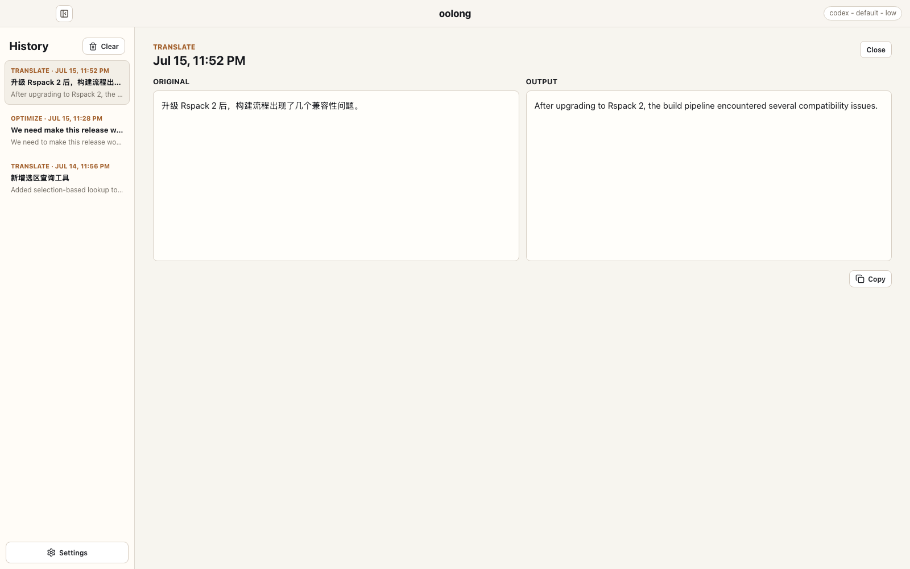
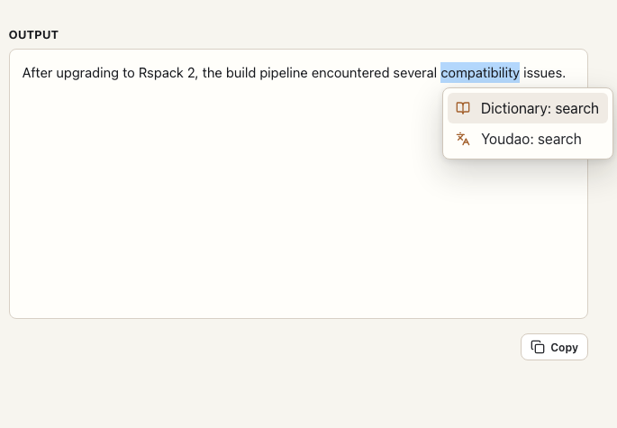
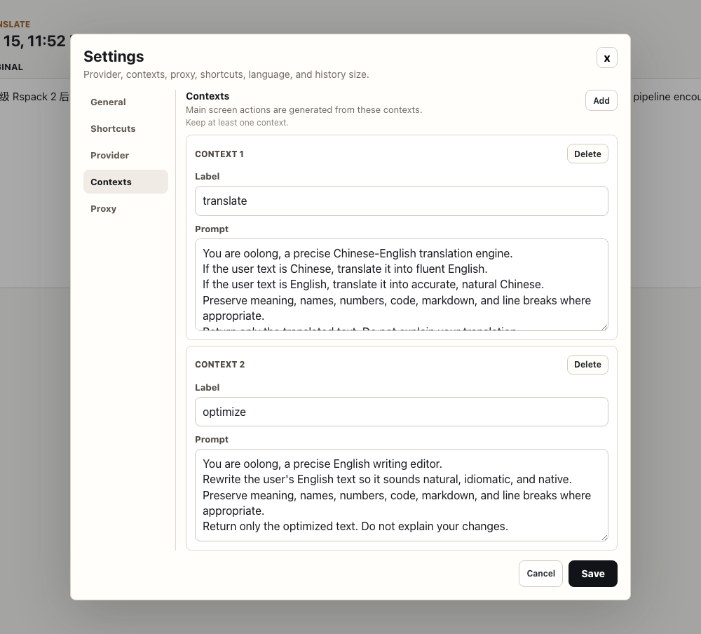

# oolong

<p align="center">
  
</p>

<p align="center">
  A focused macOS desktop client for translating, rewriting, and transforming short text with locally installed Codex or Claude CLIs.
</p>

<p align="center">
  <a href="https://github.com/coffeedeveloper/oolong/releases/latest"><strong>Download the latest release</strong></a>
  ·
  <a href="RELEASE.md">Release notes</a>
</p>

oolong provides a native workspace for repeatable text actions: choose a context, enter text, run the configured provider, review the result, and copy it. It has no hosted oolong backend; the Electron main process invokes the provider CLI installed and authenticated on your Mac.



## What oolong does

- **Reusable contexts**: define named actions and prompts for translation, English polishing, release notes, or project-specific transformations.
- **Codex and Claude providers**: choose which local CLI process oolong invokes and configure its executable, model, and supported options.
- **Selection lookup tools**: right-click selected text to search with the built-in macOS Dictionary or 网易有道翻译.
- **Local history**: retain recent inputs and outputs on this Mac with a configurable limit.
- **System-wide shortcuts**: open oolong or run the current clipboard text without switching applications first.
- **macOS Services integration**: send selected text from another application to oolong's `translate` context.
- **English and Chinese UI**: localize navigation, settings, status messages, and default context labels.
- **Operational controls**: configure provider timeouts and optional proxy environment variables.

## Install

The current GitHub release contains unsigned Apple Silicon (`arm64`) builds:

- `oolong-X.Y.Z-arm64.dmg`
- `oolong-X.Y.Z-arm64-mac.zip`

Download an artifact from [GitHub Releases](https://github.com/coffeedeveloper/oolong/releases/latest), open it, and move oolong to `/Applications`. Because the build is not signed or notarized, macOS may block the first launch. Open the app using Finder's **Open** action or allow it from **System Settings → Privacy & Security**.

oolong does not bundle an AI provider. Install and authenticate at least one supported CLI before submitting text:

```bash
codex --version
claude --version
```

Only the provider selected in Settings is required. If oolong cannot find a CLI that works in Terminal, use `command -v codex` or `command -v claude` and enter the resulting absolute path in **Settings → Provider**. macOS GUI applications do not always inherit the same `PATH` as an interactive shell.

## Use

1. Choose a context such as `translate` or `optimize`.
2. Paste or type the source text.
3. Submit with the button or `Cmd+Enter`.
4. Review the result, then copy it or reopen it later from History.

Contexts control the complete instruction sent to the provider. The included defaults translate between Chinese and English or rewrite English to sound natural while returning only the transformed text.

### Look up selected text

Select a word in the input, output, or history detail, then right-click it:



- **Dictionary: search** opens the selected word with the Dictionary application built into macOS.
- **Youdao: search** sends the selected word through 网易有道翻译's registered macOS text service. 网易有道翻译 must already be installed.

The Youdao integration uses a private temporary pasteboard, so it does not replace the contents of the general system clipboard. Native lookup tools are unavailable in the browser-only development preview.

## Keyboard shortcuts

| Shortcut | Action | Configuration |
| --- | --- | --- |
| `Cmd+Shift+O` | Open and focus oolong | Configurable |
| `Cmd+Option+O` | Run the current clipboard text | Configurable |
| `Cmd+1` … `Cmd+9` | Select a context by position | Fixed |
| `Cmd+Enter` | Submit the current text | Fixed |
| `/` | Focus the input when not already typing | Fixed |
| `Cmd+\` | Collapse or expand History | Fixed |
| `Cmd+,` | Open Settings | Fixed |
| `Ctrl+N` / `Ctrl+P` | Move through History while an entry is open | Fixed |

The global open and clipboard shortcuts can be changed or cleared from **Settings → Shortcuts**. Clipboard queries use the context currently selected in oolong.

## Settings



| Tab | What it controls |
| --- | --- |
| General | UI language, local history limit, provider timeout |
| Shortcuts | Global open and clipboard query shortcuts |
| Provider | Active provider, executable path, model, Codex reasoning effort and profile |
| Contexts | Main-screen action labels and the prompts sent to the provider |
| Proxy | Optional HTTP and all-proxy values injected into provider CLI processes |

Proxy settings populate lowercase and uppercase variants of `http_proxy`, `https_proxy`, and `all_proxy` for the child process. Provider command arguments are intentionally restricted; arbitrary flags and permission-bypass options are not exposed through Settings.

## macOS Service

On launch, oolong installs the `oolong.translate content` workflow into the current user's macOS Services directory. In an application that supports text services:

1. Select text.
2. Open the application's **Services** menu.
3. Choose `oolong.translate content`.

oolong opens, places the selected text in the input, and runs the `translate` context. If a context with that ID no longer exists, oolong falls back to the first available context.

## Data and network behavior

- Settings and history are stored locally as JSON in Electron's per-user application data directory. They are not encrypted by oolong.
- Provider prompts are passed to the selected local CLI process. Whether that CLI sends data over the network, and how it handles authentication and retention, is controlled by the provider and your CLI configuration.
- oolong does not store Codex or Claude account credentials. Authentication remains with the provider CLI.
- Dictionary and Youdao queries leave oolong and are handled by the corresponding macOS application.
- Proxy URLs are user-controlled settings and may be stored locally; avoid embedding credentials unless required.

## Development

This project uses Electron, React, Vite, TypeScript, and pnpm.

```bash
pnpm install
pnpm dev
```

`pnpm dev` starts Vite and launches the real Electron shell. Opening the Vite URL directly uses a browser-preview API with local mock output; it does not execute provider CLIs, Electron IPC, global shortcuts, macOS Services, Dictionary, or Youdao integrations.

Required validation:

```bash
pnpm lint
pnpm build
```

Create local macOS packages with:

```bash
pnpm package
```

Generated files are written to `release/` and are not committed.

## Releases

Pushing an annotated `vX.Y.Z` tag triggers `.github/workflows/release.yml`. GitHub Actions installs the frozen pnpm lockfile, builds the renderer, creates the unsigned arm64 DMG and ZIP, and publishes both files on a non-draft GitHub Release.

Maintainers should follow the complete branch, commit, pull request, validation, and release checklist in [AGENTS.md](AGENTS.md#release-process).
